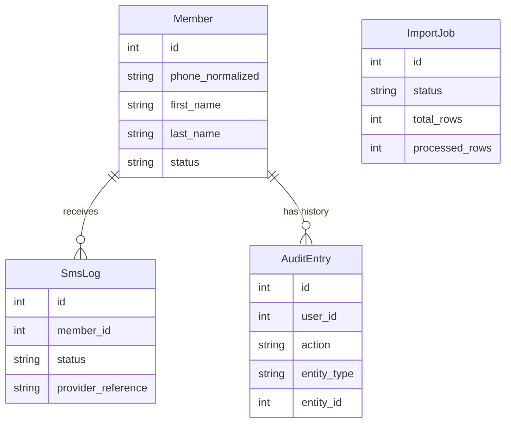

# Domain Model

## Core Entities
- **Member**: Central entity representing a club member.
- **SmsLog**: Record of an SMS sent to a member.
- **AuditEntry**: Record of an administrative action or system event.
- **ImportJob**: Represents a background process for importing members.

## Value Objects
- **PhoneNumber**: Encapsulates phone number validation and normalization.
- **MembershipSource**: Identifies where a member originated (e.g., Manual, WooCommerce, Import).

## Entity Relationships

## Member Lifecycle States
- **Active**: Normal state, member receives SMS and benefits.
- **Inactive**: Member is disabled, does not receive regular communications.
- **Suspended**: Member is banned or temporarily suspended.

## Business Rules
- **Phone Number Normalization**: Persian/Arabic digits are converted to Latin. Number is validated for country codes. Canonical format used internally: `09XXXXXXXXX`.
- **Duplicate Detection Priority**: 
  1. `phone_normalized` in Members table
  2. WordPress user phone/meta
  3. WooCommerce billing phone
- **Member-User Separation**: A "Member" is a business entity in the club. A "User" is a WordPress identity. They are linked but independent.
- **SMS Dependency**: Membership creation/management is independent of SMS delivery success.
